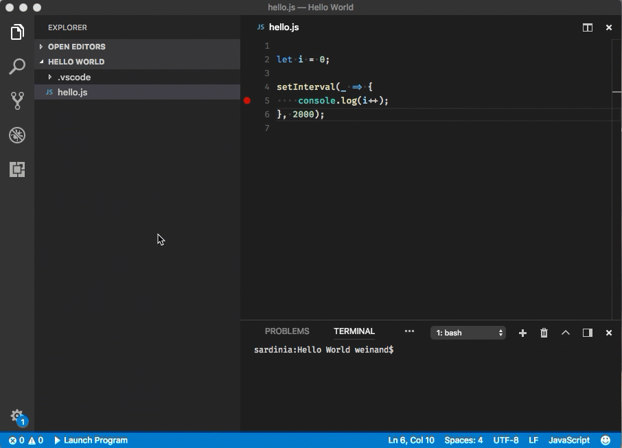

# VS Code Processes

The VS Code Processes extensions shows all child processes of VS Code in a custom view in the VS Code Explorer.



From the context menu of a process node you can terminate the process or attach a debugger to it.

## Installing VS Code Processes

This extension is still a prototype and so it is not yet available on the Marketplace but you can easily build the vsix with these commands:

```
  git clone https://github.com/weinand/vscode-processes
  cd vscode-processes
  npm install
  npm run package
```

Then use VS Code's **Install from VSIX...** command to install the extension.

## Using VS Code Processes

By default the Process View is not shown. To open it use the "Show Process View" command.

The context menu of a process node in the tree supports these actions:

- **Kill:** tries to kill the process by sending a `SIGTERM` signal.
- **Force Kill:** forcefully kills the process by sending a `SIGKILL` signal.
- **Start Node Debugging:** this action is only available if the process is identified as a node.js process that supports debugging. The heuristics uses the command line arguments of the process: if a `--inspect`, `--inspect-brk`, `--debug`, or `--debug-brk` flag is found (with or without port number), a debug session is started against a debug port. If none of the flags are found but the process executable is `node` a debug session is started via the process ID and the SIGUSR1 mechanism.

More actions are planned in the future.
